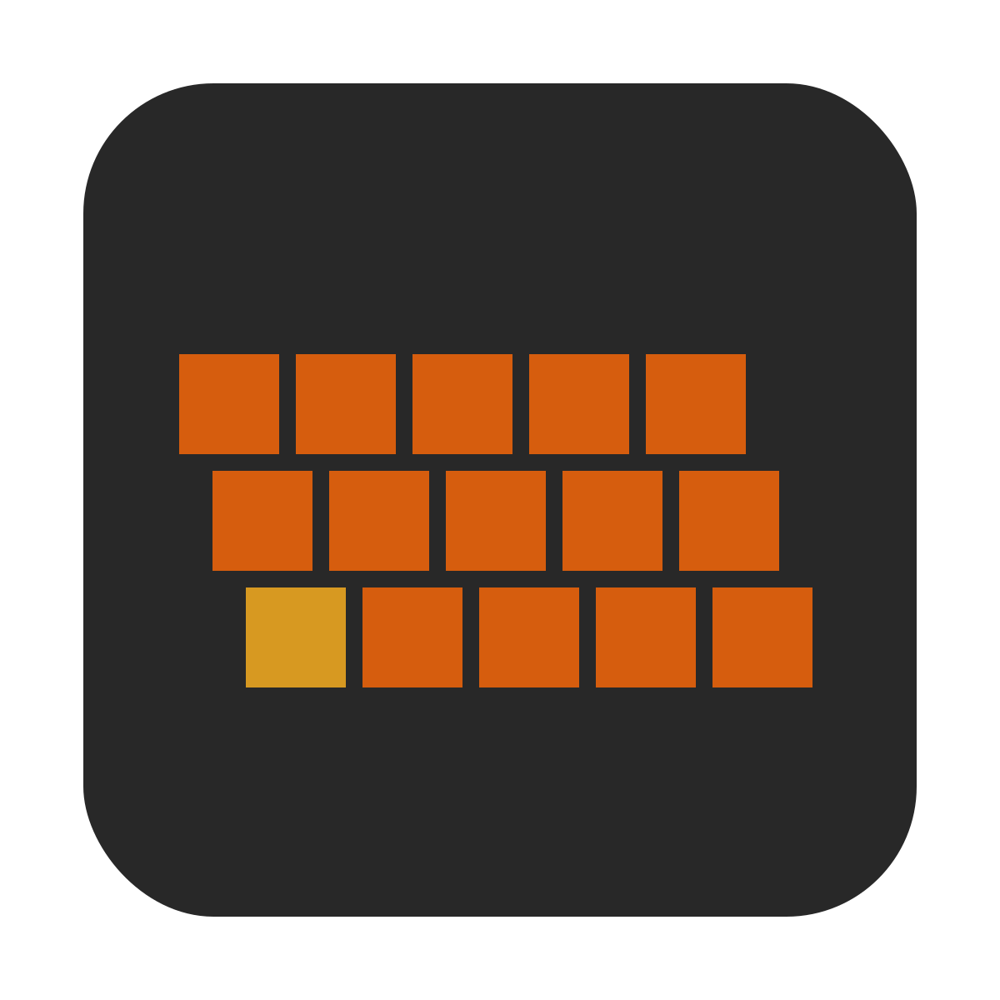

# Typebeat

Running the native app locally requires the following dependencies:

- [Rust](https://www.rust-lang.org/learn/get-started)
- [Node/NPM](https://nodejs.org/)
- [Faust](https://github.com/grame-cncm/faust/releases/)

```bash
npm start
```
