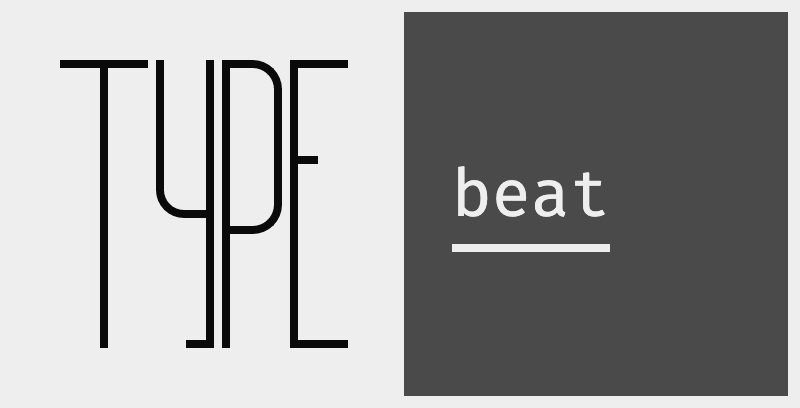

<p align="center">
  
</p>

To build this project, first install these dependencies:
 - [Faust](https://github.com/grame-cncm/faust/releases)
 - [MSVC](https://docs.microsoft.com/en-us/cpp/build/vscpp-step-0-installation?view=msvc-160) (Windows-only)
 - [WebView2](https://developer.microsoft.com/en-us/microsoft-edge/webview2/#download-section) (Windows-only)

Then run the following:
```
make
build/Typebeat
```
