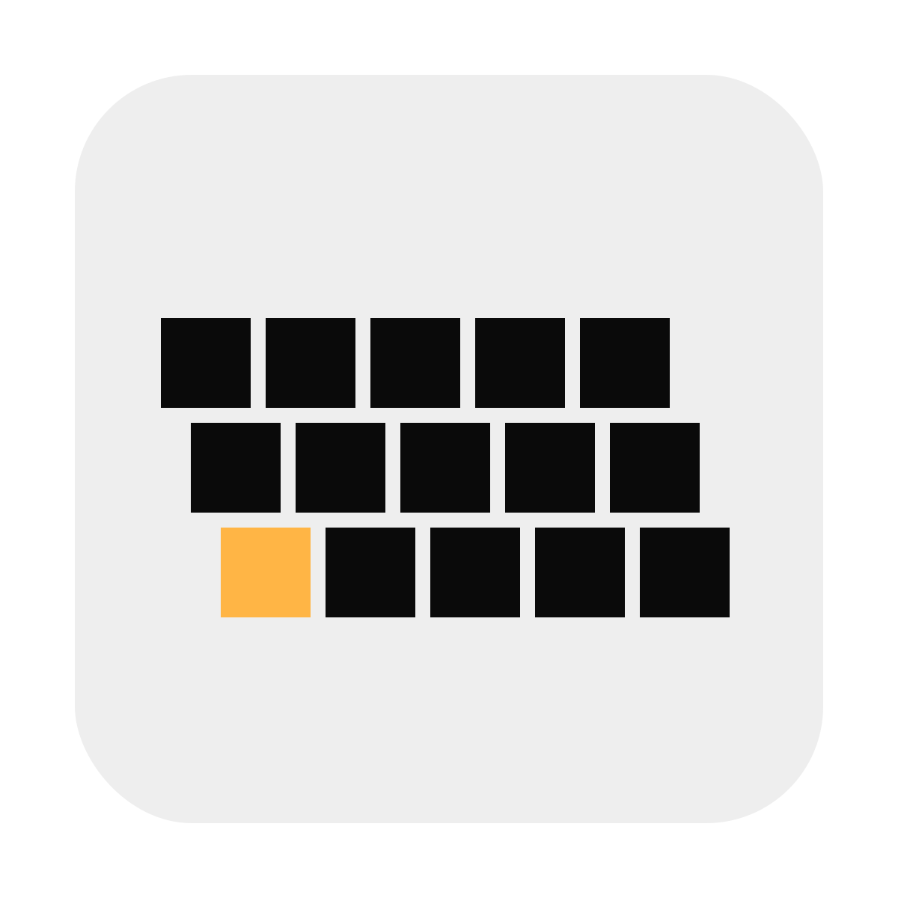

# Typebeat

Building locally requires the following build dependencies:

- [Rust](https://www.rust-lang.org/learn/get-started)
- [Node/NPM](https://nodejs.org/)
- [Faust](https://github.com/grame-cncm/faust/releases)
- [Tauri CLI](https://github.com/tauri-apps/tauri/tree/dev/tooling/cli.rs)

```bash
src-tauri/env cargo tauri dev # ✨ QUICK-START COMMAND 💫
```
