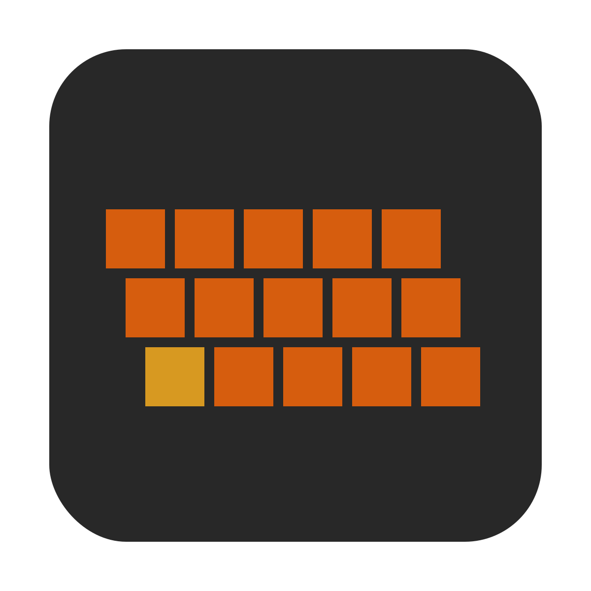

# Typebeat

## Native app development

- [Install Rust/Cargo](https://www.rust-lang.org/learn/get-started)
- [Install Node/NPM](https://nodejs.org/)
- Run `npm run-script init`
- Run `npm start` to start the dev process

## Website development

- [Install Rust/Cargo](https://www.rust-lang.org/learn/get-started)
- [Install Node/NPM](https://nodejs.org/)
- [Install Emscripten](https://emscripten.org/docs/getting_started/downloads.html)
- Run `npm run-script website` to start the dev process
