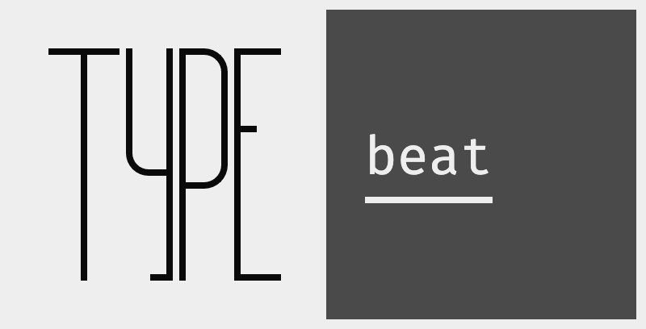

<h1 align="center">
  
</h1>

Typebeat uses the following build dependencies:

- [Rust](https://www.rust-lang.org/learn/get-started)
- [Faust](https://github.com/grame-cncm/faust/releases)
- [Emscripten](https://emscripten.org/docs/getting_started/downloads.html) (only required for web)

Run the native app with:

```bash
cargo run -p typebeat-tauri # ✨ QUICK-START COMMAND 💫
```

Build the web app with:

```bash
src-wrb/run-cargo build
```
